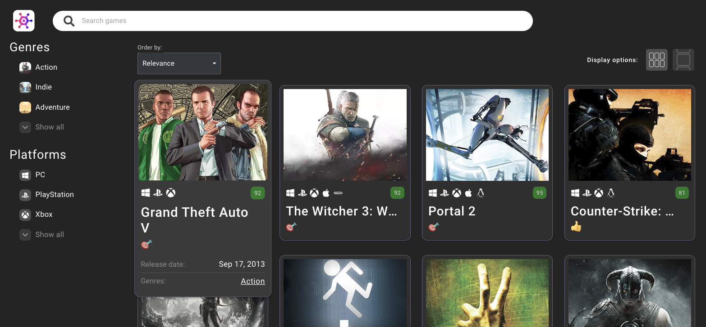
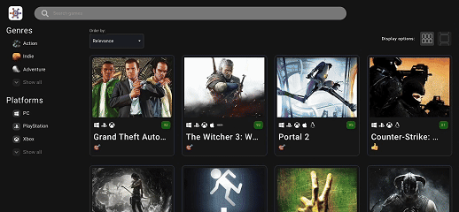
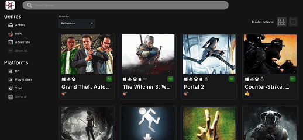
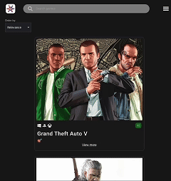

# React Game Hub App.

This project consist in a modern web application designed for exploring and browsing video games. The app is built with React, TypeScript, TanStack Query, and Material-UI, providing an optimized and interactive user experience.

## Features

### Game Exploration

- Game Filters: Filter games by genre, platform, and other criteria.
- Search Functionality: Debounced search bar for real-time search queries.

### Sidebar Interaction

- Scrollable Sidebars: Use sidebars to browse genres and platforms.
- Dynamic Selection: Sidebars dynamically highlight selected items.

### Game Cards

- Interactive Cards: Hover or click on game cards to view additional details.
- Image Optimization: Dynamically resized images for better performance.
- Fully optimized for both desktop and mobile devices.

## Developed Using:

### TanStack Query

- Advanced state management and data fetching solution.
- Features: Optimized API requests, caching, and query invalidation.

### Material-UI

- React library for Google's Material Design.
- Features: Prebuilt components for faster development and a responsive dark theme.

### Axios

- HTTP client for API communication.

### RAWG.io API

- Source of detailed game data, including genres, platforms, and ratings.
